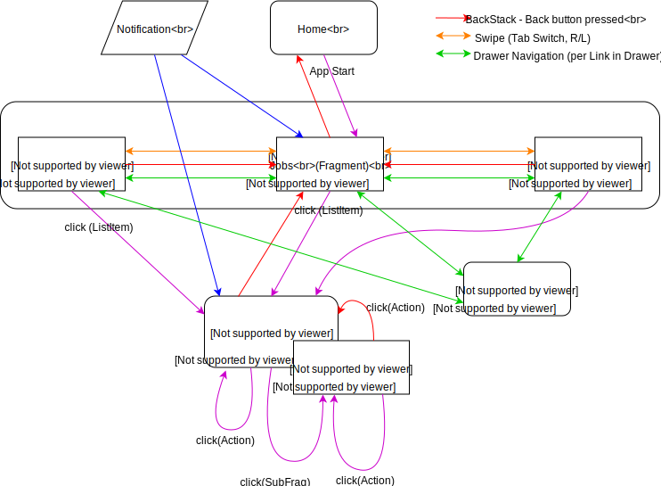

# App Documentation

## General code structure

This projects consists of multiple submodules:

| Project | Description |
| ---     | ---         |
| **smartdevicesapp.app.phone**     | This is the Android-Phone and -Tablet App Module which contains Activites, Services and Phone/Tablet specific UI-Elements as well as the general DI setup. |
| **smartdevicesapp.app.watch**     | This is the Watch App Module which contains Activites, Services and Watch specific UI-Elements as well as the general DI setup.  |
| **smartdevicesapp.common**        | The common Module consists mostly of Utility classes.|
| **smartdevicesapp.model**         | The model Module contains all Entity definitions as well as Repositories, Management-Classes and NetworkServices |
| **smartdevicesapp.service**       | The service Module contains non Android specific Network Services and general definitions. |
| **smartdevicesapp.viewelements**  | The viewelements Module is a Android Library Module which is used by the .app.phone and the .app.watch App. It contains all generalized Viewelements, Viewmodels, UiComponents and Services. Additionally it holds most of the Android Resources, especially all general used drawables. |

## Architecture

### UI Structure

The general Ui-Layout is separated into two main Components, the Overview (MainActivity) and the ConfigurableJobView (JobActivity). In addition there are View components for Settings and Sub-Job-Views.

#### Overview (Main Activity)
The Overview consists of a *ViewPager* with one or multiple Tabs wich are generated via the [Ui-Configuration](#Ui-Configuration). Each Tab is defined via a keyword like "dasbboard" or "actions" can have different fitler and sort options.

Each Tab consists of a *RecyclerView* which shows all Entries proviced by the SDGW in an vertical scrollable list.

shows can show [Ui-Components](#Configurable UI-Components)

#### JobView (Job Activity)
#### Settings
#### Todo-Step Activity

### The "Job"-Structure

### Configurable UI-Components

## Configuration / Interface

### Ui-Configuration

## User Interaction
To create a better and more intuitive User Experience the App follows the Material-Design Interaction recommendations. The following diagramm shows how the User can Navigate between the different App-Screens.

